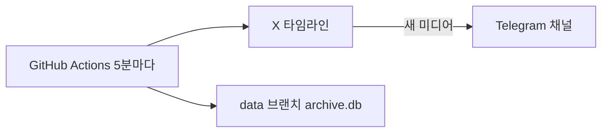

# x-art-archiver

X(트witter)에서 특정 계정이 올린 **그림·동영상·GIF**를 주기적으로 확인하고, 삭제되기 전에 자동 저장하는 도구입니다.

## PC 꺼도 되는 무료 실행 (추천)

**GitHub Actions + Telegram** 으로 24시간 무료 실행할 수 있습니다.

| 항목 | 설명 |
|------|------|
| 실행 | GitHub 서버에서 5분마다 자동 |
| 저장 | Telegram 비공개 채널 |
| 비용 | 0원 (public repo 기준) |
| PC | 꺼도 됨 |

**설정 가이드:** [SETUP_CLOUD.md](./SETUP_CLOUD.md)  
**자동 설정 스크립트:** `.\setup-cloud.ps1`

---

## 로컬 실행 (PC 켜 둘 때)

### 1. 설정 파일

```powershell
copy config.example.yaml config.yaml
```

`accounts`에 작가 핸들, `auth_token` / `ct0` 쿠키 입력.

### 2. 실행

```powershell
.\run.ps1          # 계속 실행
.\run.ps1 --once   # 1회 테스트
```

저장 위치: `downloads/작가핸들/`

---

## 아키텍처 (클라우드)



---

## 주의사항

- **개인 보관용**으로만 사용하세요.
- X 쿠키는 주기적으로 갱신이 필요할 수 있습니다.
- GitHub Actions cron은 최소 **5분** 간격입니다.
